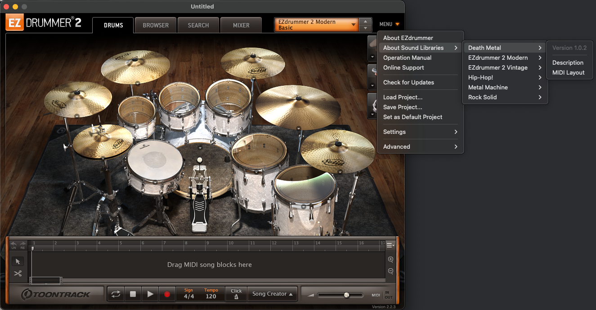
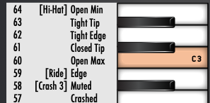

# Mapping

This document gives guidance about

* writing templates or concrete mappings for the tool
* best practices
* tutorials

## File format

* The file is expected to be a CSV with comma (`,`) as the value delimiter and UTF-8 as charset.
* Every line is interpreted (No headers in file).
* MIDI Notes which have no mapping defined in the file are treated as `destination = origin`

The columns are defined as:

| Origin MIDI Note                                     | Origin Description                      | Destination MIDI Note                                                                                         | Destination Description                 |
|------------------------------------------------------|-----------------------------------------|---------------------------------------------------------------------------------------------------------------|-----------------------------------------|
| integer between `0 - 127`<br/>(e.g. valid MIDI note) | any string not containing a comma (`,`) | integer between `0 - 127`<br/>(e.g. valid MIDI note) or<br/>blank (which translates to `destination = origin` | any string not containing a comma (`,`) |

Also see [RemapDefinitionFileReader](../src/main/java/at/elmecker/midiremap/definition/RemapDefinitionFileReader.java).

## Folder/file structure

The base folder `mappings` contains

* subfolders for individual MIDI software
* generic mapping templates
* this readme

```
mappings/
├─ ezd2/
...
├─ gp/ 
├─ general_midi.csv
├─ README.md
├─ template.csv
├─ template_reverse.csv
```

## Subfolders for individual MIDI software

### templates vs remapping files

#### remapping files

Both origin and destination are filled accordingly to the file format.\
These files will be specified with the command to do the actual remapping.

The naming is `<origin software folder>/<origin variant>-<destination software variant>.csv`.\
For example: `ezd2/rock_solid-gp7_6.csv`

#### templates
Templates are either found in the root `mappings` folder or in `template/` of each software subfolder.\
The file only contains the Origin columns filled and can be used as a base for introducing a new mapping file.

The naming is `<origin software folder>/<origin variant>.csv`.\
For example: `ezd2/rock_solid-gp7_6.csv`

### Structure

The subfolder is named (or abbreviated) according to the software name
(e.g. `ezd2` for *EZDrummer2* or `gp` for *Guitar Pro*)
and it contains

* actual mappings to other software specific MIDI formats (root of subfolder)
* templates for the own specific MIDI formats (in `template/`)

### Finding the correct mapping

**Example**

I recorded my MIDI drums in my DAW using *EZDrummer2* with the *Rock Solid* drum kit/layout.\
As I have other instruments as well that I want to tab out, it would make sense to tab everything in *Guitar Pro*
for later reference.

The fastest way to get the drums into *Guitar Pro* is to take the recorded MIDI file and import it there, but the MIDI
notes do not align well.\
I will have to remap them first.

**Q&A**

Q: *Which software is the source of your MIDI file?*\
A: Go to the subfolder for that software, `ezd2` for example.

Q: *Which kit am I using/Is the MIDI file based upon?*\
A: Look for mapping files starting with your kit name, like `rock_solid`.

Q: *What's the software I want to use the MIDI file in?*\
A: Look for mapping files with the destination software name as an ending, `gp7_6`.

The final answer then will be to use `/mappings/ezd2/rock_solid-gp7_6.csv` to correctly map the MIDI file.

## tutorials

### How to find the mapping of a drum kit in EZDrummer2

In EZDrummer2 go to
1. MENU (upper right)
2. About Sound Libraries
3. *Sound Library Name*
4. MIDI Layout



This will open up a PDF showing the MIDI notes and a description for each.

It shows the following in a column like manner (left to right):

* MIDI Note
* Note Description
* Note



**Note:**

* The file is to be interpreted from top to bottom 
* Not all MIDI notes may be displayed/in use
* The note mapping (e.g. C0) can be ignored, we are using MIDI notes 0-127 only